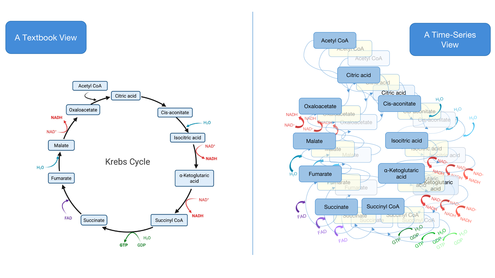
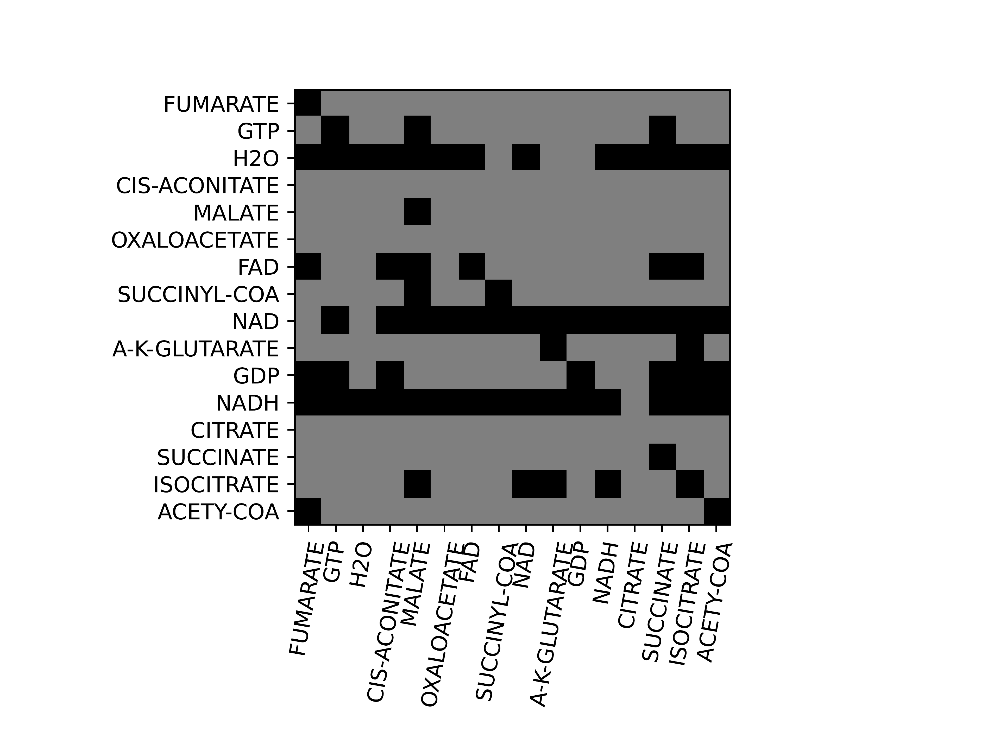
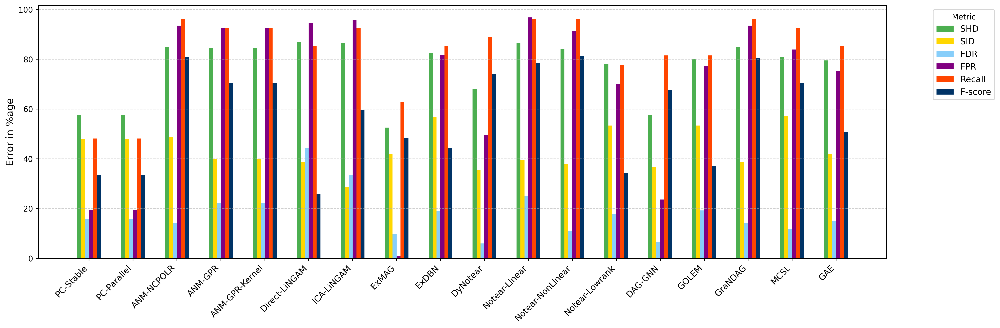
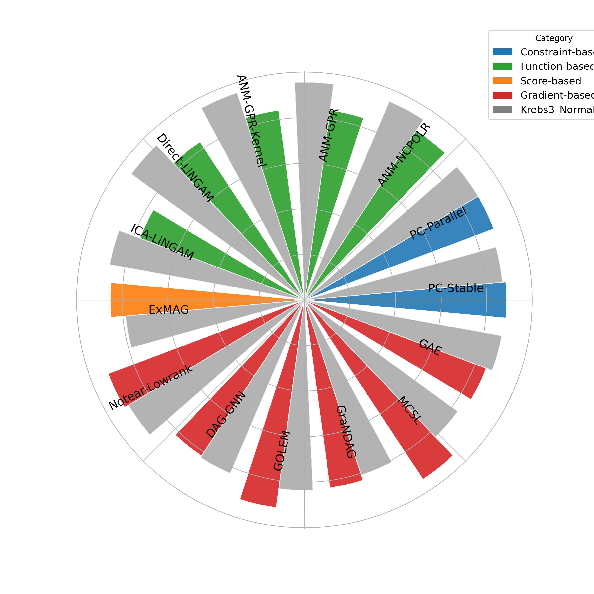

# Causal Learning Benchmark

This project is a benchmark pipeline for causal discovery built around original acyclic generated Krebs-cycle datasets. It provides a unified benchmark covering 22 methods, together with dataset generation, evaluation metrics, heatmaps, and circle barplots.

Related paper:

- [Causal Learning in Biomedical Applications: Krebs Cycle as a Benchmark](https://arxiv.org/html/2406.15189v3)

## Overview
The 22-method benchmark covers constraint-based, functional-model-based, score-based, and gradient-based causal discovery families, including `PC-Stable`, `PC-Parallel`, `ANM-NCPOLR`, `ANM-GPR`, `ANM-GPR-Kernel`, `Direct-LiNGAM`, `ICA-LiNGAM`, `PNL`, `GES`, `ExMAG`, `ExDBN`, `DyNotear`, `Notear-Linear`, `Notear-NonLinear`, `Notear-Lowrank`, `DAG-GNN`, `GOLEM`, `GraNDAG`, `MCSL`, `GAE`, `RL`, and `CORL`.

## Datasets
The benchmark includes four Krebs-cycle dataset variants:

| Dataset | N. features | Length | N. series | Initialisation | Concentrations |
| --- | ---: | ---: | ---: | --- | --- |
| KrebsN | 16 | 500 | 100 | Normal distribution | Absolute |
| Krebs3 | 16 | 500 | 120 | Excitation of three | Relative |
| KrebsL | 16 | 5000 | 10 | Normal distribution | Absolute |
| KrebsS | 16 | 5 | 10000 | Normal distribution | Absolute |

Temporal Krebs cycle generation:

For causal discovery, we focus on an acyclic temporal view of the Krebs cycle rather than the standard cyclic textbook view. The difference is illustrated below:



## Visualisations
Metrics include `F-score`, `SHD`, `SID` when provided, `FDR`, `TPR`, `FPR`, `nnz`, `Precision`, and `Recall`. 

Dynotears heatmap example:



Krebs3 metric error barplot:



Krebs3 and normalised Krebs3 SID circle barplot:



## Evaluation

- Metrics include `F-score`, `SHD`, `SID` when provided, `FDR`, `TPR`, `FPR`, `nnz`, `Precision`, and `Recall`.
- Heatmaps compare `est_graph` and `truth_graph`.

## Requirements

Install the required software first:

```bash
brew install openjdk
```

Install the Python dependencies with:

```bash
pip install -r src/requirements.txt
```

If `openjdk` was installed with Homebrew, make sure your shell can find it:

```bash
export PATH="/usr/local/opt/openjdk/bin:$PATH"
export JAVA_HOME="/usr/local/opt/openjdk/libexec/openjdk.jdk/Contents/Home"
```

Quick checks:

```bash
java -version
javac -version
python3 -m py_compile src/scripts/main.py src/scripts/run_pipeline.py src/scripts/plot/krebcycle_heatmap.py
```

## Current Structure

```text
.
├── README.md
├── demo/
│   └── SereneHE_gCastle_project.ipynb
├── docs/
│   └── figures/
├── data/
│   ├── Krebs_Cycle_1_TS/
│   ├── Krebs_Cycle_3_TS/
│   ├── Krebs_Cycle_Normalised_1_TS/
│   ├── Krebs_Cycle_Normalised_3_TS/
│   └── true_graph.npz
├── src/
│   ├── conf/
│   ├── requirements.txt
│   └── scripts/
│       ├── main.py
│       ├── run_pipeline.py
│       ├── data_loader.py
│       ├── experiments/
│       ├── data_generator/
│       ├── methods/
│       ├── plot/
│       └── utils/
```

## Running pipeline
Generate the normalised Krebs3-style data with the default generator:

```bash
cd <repo-root>/src/scripts/data_generator
./run_data_generator.sh
```
Run a specific Java generator class:

```bash
cd <repo-root>/src/scripts/data_generator
MAIN_CLASS=Main ./run_data_generator.sh
MAIN_CLASS=LongSeries ./run_data_generator.sh
MAIN_CLASS=ShortSeries ./run_data_generator.sh
MAIN_CLASS=GroundTruthGraph ./run_data_generator.sh
MAIN_CLASS=NonUniformPrior ./run_data_generator.sh
```

Cluster config:

```bash
python3 src/scripts/main.py --config-name config-cluster
```

## Method Tests

Quick single-method smoke tests:

```bash
cd <repo-root>
python3 src/scripts/main.py problem=krebs_cycle_3 'solver.methods=[PC-Stable]' mlflow.enabled=false
python3 src/scripts/main.py problem=krebs_cycle_3 'solver.methods=[Direct-LiNGAM]' mlflow.enabled=false
python3 src/scripts/main.py problem=krebs_cycle_3 'solver.methods=[ExDBN]' mlflow.enabled=false
```

Run the full 22-method benchmark:

```bash
cd <repo-root>
python3 src/scripts/main.py problem=krebs_cycle_3 solver=notebook_all paths.data_root=<repo-root>/data
python3 src/scripts/main.py problem=krebs_cycle_normalised_3 solver=notebook_all paths.data_root=<repo-root>/data
```

Create a Dynotears-style heatmap from an estimated graph:

```bash
cd <repo-root>/src/scripts/experiments
sh ./experiments_krebcycle_heatmap.sh
```

Or call the heatmap script directly:

```bash
python3 src/scripts/plot/krebcycle_heatmap.py \
  --problem krebs_cycle_3 \
  --data-root <repo-root>/data \
  --graph-file <repo-root>/output/Results_Krebs_Cycle_3/adj_matrices/DyNotear_adj.csv
```
